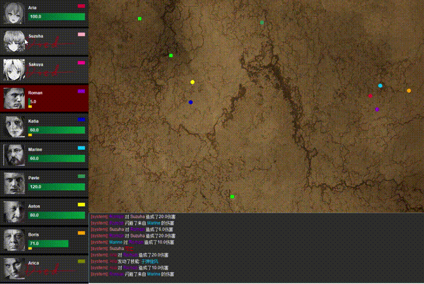
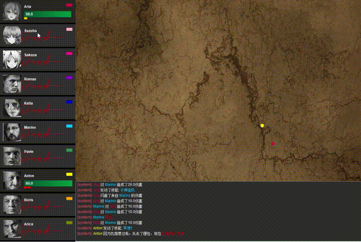

# NewWorld
一个看海模式的小游戏。使用eclipse开发环境，JPanel完成画面渲染。

> A observer mode game made with JPanel in java

完成于2019年6月，归档

[dblnjsw](https://github.com/dblnjsw)负责一部分角色技能设计和背景音乐导入

画面预览：





## 运行

编译
```
javac -sourcepath .\src -d .\bin -extdirs .\lib .\src\util\GameLaunch.java
```

运行
```
java -cp 'bin;lib/*' util.GameLaunch
```